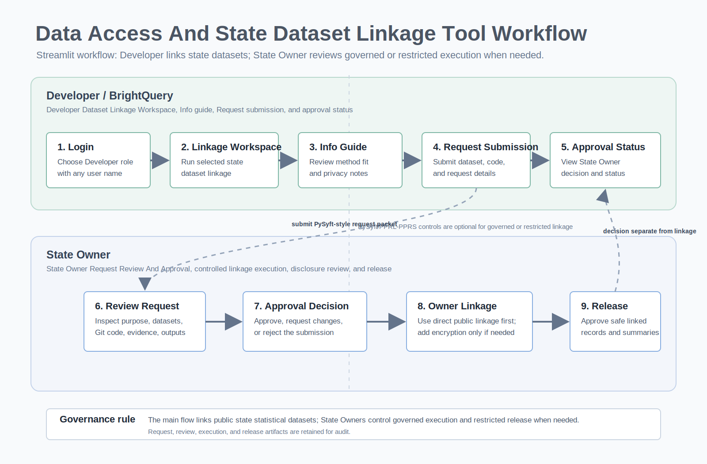

# Data Access And State Dataset Linkage Tool Understanding Document

Version: 1.0
Date: July 20, 2026

## Purpose

The Data Access and Linkage Tool supports state dataset linkage between Developer / BrightQuery users and State Owners. The main requirement is public/non-restricted statistical linkage; restricted encrypted linkage is optional when needed.

The tool allows a developer to:

- Select datasets
- Choose a linkage method
- Use the Info tab to understand linkage method options
- Submit a PySyft-style request form with data asset, code asset, execution context, output policy, and review notes
- Add a Git repository link for the code package
- Run user-side linkage
- View linkage output in the separate Linkage tab

The tool allows a State Owner to:

- Review submitted requests
- Review Git repository and code package metadata
- Approve, request changes, or reject the request
- Run owner-controlled linkage when governance is required
- Review outputs before release
- Preserve request and approval history for audit

## Workflow Image

## Current Streamlit Screen Headings

The Streamlit app uses descriptive headings aligned to the role workflow:

| Role / Area | Detailed App Heading |
|---|---|
| Login | Data Access And State Dataset Linkage Tool |
| Developer portal | BrightQuery Developer Portal For Dataset Linkage Requests |
| Developer Linkage tab | Developer Dataset Linkage Workspace |
| Info tab | Detailed Linkage Method Information And Selection Guide |
| Developer Request tab | Submit Dataset And Code Request For State Owner Review |
| Developer Request / Approval tab | Developer Request Status And State Owner Approval |
| State Owner portal | State Owner Portal For Linkage Review, Approval, And Execution |
| State Owner Linkage tab | State Owner Dataset Linkage Workspace |
| State Owner Request / Approval tab | State Owner Request Review And Approval |
| Results section | State Linkage Results From Selected Datasets |

## High-Level Workflow

1. Developer logs in as Developer / BrightQuery.
2. Developer opens **Developer Dataset Linkage Workspace** to select datasets and choose the requested linkage method.
3. Developer opens **Detailed Linkage Method Information And Selection Guide** to confirm which linkage method fits the data situation.
4. Developer submits a PySyft-style request with data asset, code asset, execution context, output policy, review notes, and Git code link.
5. Developer can use the Linkage tab to run user-side linkage for selected datasets and methods.
6. State Owner logs in as State Owner.
7. State Owner reviews the PySyft-style request packet, code package, and linkage method.
8. State Owner approves, asks for changes, or rejects the request.
9. State Owner can run controlled linkage from the Linkage tab.
10. Outputs are reviewed for disclosure risk.
11. Linkage output remains in the separate Linkage tab; request approval remains a separate status/decision flow.

## Overall Approach

The approach is a state dataset linkage workflow. The app starts with public/non-restricted statistical linkage and adds governed code-to-data controls only when approval, audit, or restricted data sensitivity requires them.

The key idea is that state datasets should be linked through shared statistical keys first. State Owners control approval and release when data sensitivity, policy, or restricted outputs require review.

The workflow uses five layers:

1. **Role layer**
   - Developer / BrightQuery runs linkage, submits requests, and adds Git code links.
   - State Owner reviews requests and approves, requests changes, or rejects when approval is needed.

2. **Dataset classification layer**
   - Public/non-restricted data can use direct shared-key linkage.
   - Restricted data can use privacy-preserving linkage.
   - Mixed public/private linkage uses the least sensitive safe route.

3. **Linkage method layer**
   - The selected method depends on data sensitivity, identifiers, legal rules, and whether parties can share raw data.
   - The app supports direct public linkage first, then AI metadata planning and optional PPRL/PPRS, SMC, honest broker, asymmetric-key, and secure enclave approaches when needed.

4. **Governance layer**
   - The request form captures the PySyft-style request packet: data asset, code asset, execution context, output policy, and review notes.
   - State Owner review records approval, requested changes, or rejection.

5. **Release layer**
   - Outputs are released only after approval.
   - Raw restricted rows and direct identifiers should not be released to the developer.
   - Released outputs should be aggregate, pseudonymous, or otherwise privacy-safe.

## PySyft-Style Architecture

The app can reflect a PySyft-style architecture when governance is required, but PySyft is not the main linkage method for public statistical data.

In a PySyft-style model:

1. Developer writes and tests linkage code outside the owner environment.
2. Developer submits code, purpose, data scope, and output request.
3. State Owner reviews the submitted request and code package.
4. Approved code runs directly for public statistical data or near restricted data when sensitivity requires it.
5. Raw restricted data stays inside the owner-controlled environment when restricted data is used.
6. Request approval decisions are tracked separately from linkage output.
7. Request, review, execution, and release records are retained for audit.

In this app:

- Request tab represents the access request and code submission.
- Linkage tab represents developer-side linkage and method selection.
- Request / Approval tab represents request status and State Owner decision.
- Linkage tab represents developer-side and owner-controlled linkage execution, shown as State Linkage Results.
- Request summaries represent the audit payload in a readable review format.

## Linkage Method Summary

| Linkage Method | What It Does | Best Fit | Privacy Notes |
|---|---|---|---|
| Direct public key linkage | Joins public datasets using shared fields such as SOC, CIP, county, state, year, or program. | Public statistical data with no restricted identifiers. | No encryption needed when data is public and approved for direct matching. |
| LLM-assisted linkage | Uses AI to review metadata and recommend keys, blocking fields, risks, and output structure. | Unfamiliar schemas or early planning. | Only metadata should be sent. Raw private rows and PII should not be sent. |
| PPRL/PPRS Bloom filter / hash embeddings | Encodes identifiers into privacy-preserving comparison structures before matching. | Optional restricted person-level linkage where fuzzy comparison is needed. | Raw identifiers should remain protected; encoded tokens are compared instead. |
| PPRL/PPRS salted hash + q-grams | Uses salted hashes and q-gram tokenization for approximate matching across names, dates, addresses, or other identifiers. | Optional restricted linkage with spelling differences, partial matches, or data quality issues. | Salt and tokenization rules should be owner-controlled. |
| Secure Multi-Party Computation (SMC) | Allows parties to jointly evaluate matching logic without exposing their private inputs. | High-assurance multi-agency linkage. | Strong privacy model, but more complex to implement and operate. |
| Linkage Honest Broker (LHB) | A trusted neutral party or broker receives approved tokens and returns cross-reference IDs. | Programs where a centralized trusted linkage agent is acceptable. | Broker governance, contracts, and audit rules are important. |
| Asymmetric key cryptography | Uses public/private key pairs so parties do not need one shared secret. | Multi-party settings where each site needs local key control. | Useful when key ownership and rotation must be separated by party. |
| PPRL/PPRS secure enclave / eyes-off execution | Runs linkage inside a controlled enclave where raw data is not visible to developers. | Optional restricted data requiring strong execution controls. | Supports code-to-data execution and output review before release. |

## Method Selection Guide

| Data Situation | Recommended Approach |
|---|---|
| Public data only | Direct public key linkage |
| Public data with unfamiliar schemas | Direct linkage plus optional LLM-assisted metadata review |
| Restricted person-level data with identifiers | PPRL/PPRS salted hash + q-grams or PPRL/PPRS Bloom filter / hash embeddings |
| Restricted data across multiple agencies | PPRL plus State Owner controlled execution, SMC, or honest broker |
| Strong rule that raw data cannot leave owner environment | PPRL secure enclave / eyes-off execution |
| Sites need separate key ownership | Asymmetric key cryptography |
| Legal or governance model requires neutral matcher | Linkage Honest Broker |

## Developer Workflow

1. Login as Developer / BrightQuery.
2. Open Request.
3. Select mock datasets or upload CSV files.
4. Classify uploaded data as public or restricted.
5. Choose linkage method and thresholds.
6. Complete the PySyft-style request packet.
7. Add Git repository link, branch, commit or tag, and code path.
8. Submit request and code.
9. Open Linkage to run user-side linkage.
10. Open Request / Approval to view request status and State Owner decision.

## State Owner Workflow

1. Login as State Owner.
2. Open Request / Approval.
3. Review dataset pair, classification, requested method, Git code package, execution context, output policy, and review notes.
4. Save a decision: approve, request changes, or reject.
5. Open Linkage to run owner-controlled linkage.
6. Review linked records, aggregate summaries, match quality, and disclosure risks.
7. Keep linkage output separate in the Linkage tab.

## Output Controls

Restricted outputs should follow release controls:

- Do not release raw restricted rows.
- Do not release direct identifiers.
- Prefer aggregate tables, pseudonymous IDs, match quality summaries, and dashboard-ready outputs.
- Review small cells and re-identification risk.
- Keep request, review, execution, and release records for audit.

## Summary

The Data Access and Linkage Tool combines a developer-facing request and linkage experience with a State Owner approval and execution workflow.

The approach supports state dataset linkage first, with public/non-restricted statistical linkage as the primary path. PySyft governance and PPRL/PPRS encrypted linkage are optional controls for sensitive or restricted cases.
